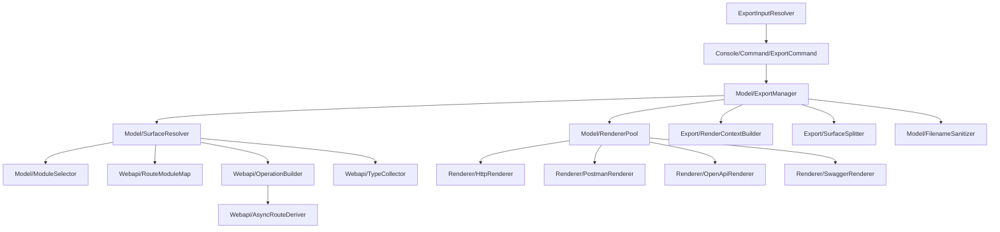

# Muon_ApiSchemaExport — Technical Reference

Generated 2026-08-24. Every entry cites the file it was extracted from.

## Architecture



## Public API surface

Ten `@api` interfaces, all under `Api/`.

| Interface | Purpose | Source |
|---|---|---|
| `Api\Data\OperationInterface` | One REST operation, with the module(s) declaring it | `Api/Data/OperationInterface.php` |
| `Api\Data\ApiSurfaceInterface` | The resolved, renderable operation set plus its type definitions | `Api/Data/ApiSurfaceInterface.php` |
| `Api\Data\RenderContextInterface` | Per-render inputs: base URL, title, serialisation | `Api/Data/RenderContextInterface.php` |
| `Api\Data\ExportRequestInterface` | One export request as supplied by a front-end | `Api/Data/ExportRequestInterface.php` |
| `Api\Data\ExportResultInterface` | Generated files, module names, resolved base name | `Api/Data/ExportResultInterface.php` |
| `Api\ModuleSelectorInterface` | Selector strings → enabled module names | `Api/ModuleSelectorInterface.php` |
| `Api\SurfaceResolverInterface` | Selection → complete renderable surface | `Api/SurfaceResolverInterface.php` |
| `Api\RendererInterface` | One output format | `Api/RendererInterface.php` |
| `Api\RendererPoolInterface` | Renderer registry | `Api/RendererPoolInterface.php` |
| `Api\ExportManagerInterface` | Façade shared by every front-end | `Api/ExportManagerInterface.php` |

## DI preferences

Nine, all in `etc/di.xml`. Each `Api\…Interface` binds to its `Model\…` implementation.

## Extension points

### Renderer pool — add an output format

A new format is one class implementing `Api\RendererInterface` plus one node in `di.xml`:

```xml
<type name="Muon\ApiSchemaExport\Model\RendererPool">
    <arguments>
        <argument name="renderers" xsi:type="array">
            <item name="asciidoc" xsi:type="object">Acme\Docs\Model\Renderer\AsciiDocRenderer</item>
        </argument>
    </arguments>
</type>
```

The pool indexes by the renderer's own `getCode()`, not by the array key, and rejects anything that
is not a `RendererInterface` at construction. Source: `Model/RendererPool.php`, `etc/di.xml`.

### Event — amend the resolved surface

`muon_api_schema_export_surface_resolved`, dispatched once per resolve, before type collection.
Declared as `SurfaceResolver::EVENT_SURFACE_RESOLVED` in `Model/SurfaceResolver.php`.

| Parameter | Type | Purpose |
|---|---|---|
| `selectors` | `string[]` | The raw selectors requested |
| `modules` | `string[]` | The modules they resolved to |
| `transport` | `Magento\Framework\DataObject` | Holds the operations array under `operations` |

Replace `transport`'s `operations` array to add, remove or annotate operations. The array is read
back and re-validated, so anything that is not an `OperationInterface` is discarded rather than
reaching a renderer. Type collection runs **after** the event, so operations an observer adds still
get their schema definitions.

## Console command

| Command | Class | Registered in |
|---|---|---|
| `muon:api-schema:export` | `Console/Command/ExportCommand.php` | `etc/di.xml` → `Magento\Framework\Console\CommandListInterface` |

## ACL

| Resource | Title | Source |
|---|---|---|
| `Muon_ApiSchemaExport::main` | API Schema Export | `etc/acl.xml` |
| `Muon_ApiSchemaExport::export` | Generate API Schema | `etc/acl.xml` |

Declared here and consumed by `Muon_ApiSchemaExportAdminUi`, matching the project convention where
the core module owns the resource and the admin module references it.

## How attribution works

`Magento\Webapi\Model\Config::getServices()` returns the merged route table with the declaring
module already discarded. `Model/Webapi/RouteModuleMap.php` recovers it by reading the same files
individually — `Module\Dir\Reader::getConfigurationFiles('webapi.xml')` yields a path per file, and
each path maps to a module through `ComponentRegistrar`. Matching is longest-prefix on a directory
boundary, so `Muon_Cart` cannot claim `Muon_CartRecalculation`'s files. Because `Dir\Reader` walks
only enabled modules, disabled ones are excluded structurally. The map is cached under the `config`
cache tag, keyed by a hash of the enabled-module set.

A route declared by two modules is attributed to **both** — webapi.xml merges, so a core route
amended by an extension is declared twice, and a selector matching either must find it.

## Reflection is bounded by the selection

`Model/Webapi/OperationBuilder.php` reflects only the service methods the selection reaches, via
`Magento\Webapi\Model\Config\ClassReflector`, memoised per method. It deliberately does **not** call
`ServiceMetadata::getServicesConfig()`, which reflects every contract on the installation: a single
contract Magento cannot reflect — a bare `array` with no item type — would then break every export,
including ones that never selected the offending module. A contract that cannot be reflected
degrades to empty metadata for that one operation and logs a warning naming it; the route, method,
ACL and attribution are all still emitted.

## Async and bulk variants

`Model/Webapi/AsyncRouteDeriver.php` reproduces `Magento\WebapiAsync\Model\Config`'s rule: every
**non-GET** route gains an `/async/V1` single-entity variant and an `/async/bulk/V1` array variant,
both returning `AsyncResponseInterface`. Gated on `Module\Manager::isEnabled('Magento_WebapiAsync')`,
so the dependency stays soft.

The bulk variant's request body is an **array** of the single-item body.
`OperationInterface::getInputParameters()` still describes one item, because that is what the
reflected metadata describes; wrapping it is the renderer's job, handled once in
`Model/Renderer/AbstractRenderer.php`.

## No schema changes

The module is stateless — no `db_schema.xml`, no tables, no data patches. The only filesystem writes
are the CLI's output directory (default `var/api-schema-export`, confined beneath the Magento root
by `Magento\Framework\Filesystem`).

## Test coverage

131 unit tests, 293 assertions, 94.7% line coverage across `Api/`, `Model/` and `Console/`.
See `Test/Unit/`.
